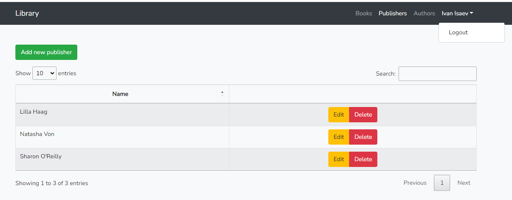
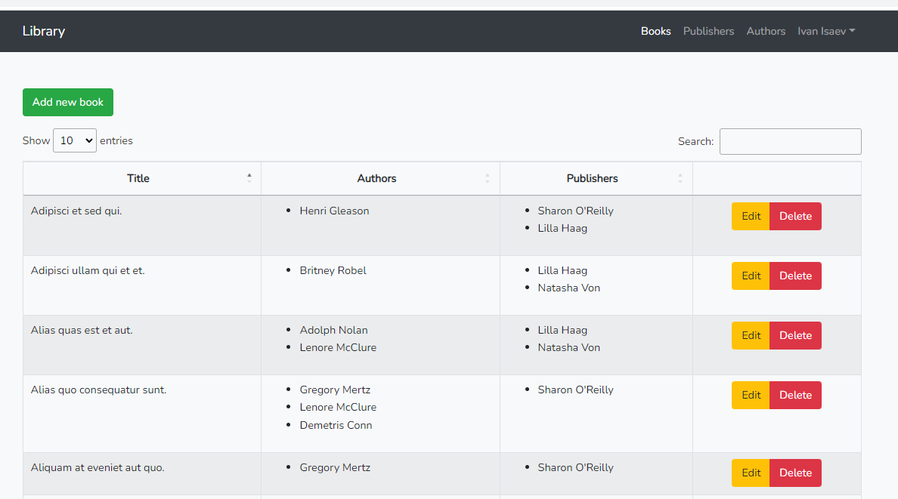
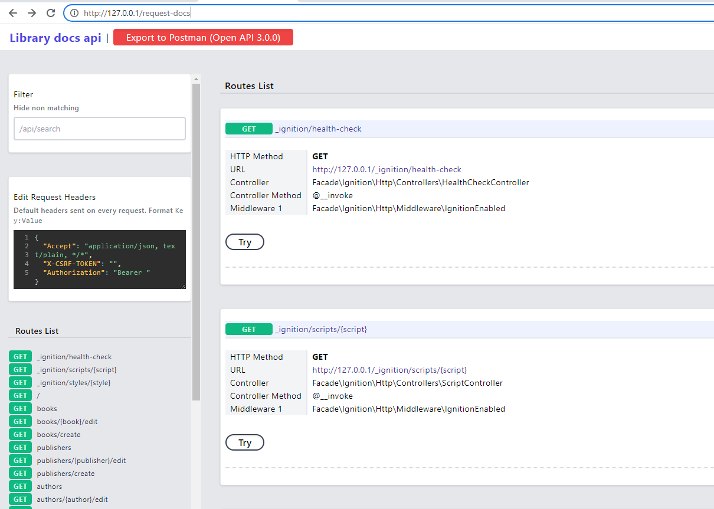

# Library
### The project is the library where third-party publishers can add books by API

## Requirements

- PHP 7.4+
- Composer
- npm

## Technologies used in production

- Laravel 8
- MariaDB
- Bootstrap 4
- Jquery  
- Laravel UI

## Technologies used in local
- Docker
- Laravel Sail
- MariaDB
- Laravel request docs

## Install && run in production

1. Clone repo on server
2. Copy `.env.example` to `.env`
3. Change env variables for yourself
4. Run command: `composer install --no-dev --prefer-dist`
5. Run commands: `npm install && npm run dev`
6. Run command: `php artisan migrate`
7. Run command:  `php artisan db:seed`

## Run in local

1. Clone repo on local machine
2. Copy `.env.example` to `.env`
3. Change env variables for yourself
4. Run command: `composer install`
5. Run commands: `npm install && npm run dev`
6. Run command: `php artisan migrate`
7. Run command:  `php artisan db:seed`

  Or you can use [sail](https://laravel.com/docs/8.x/sail) wrap commands

8. To run local server use command `sail up`

## Documentation API

To read API documentation go to route `/request-docs`

